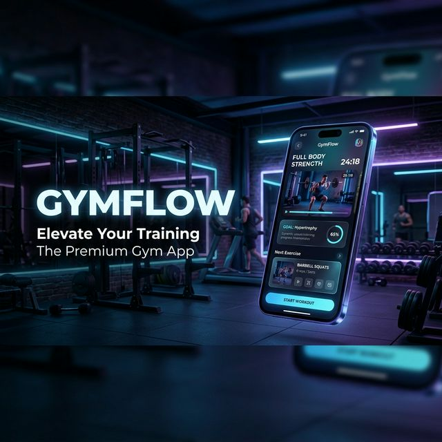

  
  <h1 align="center">GYMFLOW</h1>
  

    <strong>Tu progreso físico no es lineal. Tu constancia sí debe serlo.</strong>
     
    <em>La experiencia definitiva en seguimiento de fuerza. 100% Offline. Estética Neon-Premium.</em>
  

  

  

    
    
    
  

---

## ⚡️ La Evolución del Entrenamiento

**GymFlow** no es simplemente otro cuaderno digital. Es un motor de ingeniería diseñado para el **atleta de alto rendimiento**. Con una interfaz inspirada en el *Glassmorphism* y una paleta de colores **Neon Blue & Purple**, GymFlow transforma la tediosa tarea de registrar series en una experiencia visualmente estimulante y fluida.

## ✨ Características de Élite

### 💎 Interfaz Neon-Glassmorphism
Olvida las apps aburridas. GymFlow utiliza un diseño oscuro profundo con acentos neón que brillan en cada interacción, optimizado para ser usado incluso con las manos sudadas tras un set pesado.

### 🧪 Algoritmo de Carga Real (%)
No inflamos tus números. Nuestro algoritmo exclusivo calcula la **Carga Media de Sesión**:
- Promedia los pesos por ejercicio (Serie 1: 100kg + Serie 2: 50kg = **75kg Promedio**).
- Promedia los resultados de todos los ejercicios para darte un **% Real de Esfuerzo de Sesión**.

### 📚 Biblioteca Hiper-Segmentada
- **Músculos:** De Bíceps a Pantorrilla, todo indexado.
- **Tipos de Serie Pro:** Descarga Biomecánica, Aproximación, Rest-Pause, Fallo, Biserie y más.

### 🏆 Gamificación y Disciplina
Sube de rango desde un *Huevo de Pez* hasta convertirte en el legendario **Pez Espada**. Tu racha y tus PRs (Récords Personales) son el motor de tu evolución.

## 🛠️ Stack Tecnológico

GymFlow está construido sobre bases sólidas para garantizar que **tus datos son tuyos**:
- **Flutter SDK**: Rendimiento nativo de 60FPS.
- **SQLite (Local-Only)**: Privacidad absoluta. Carga instantánea sin latencia de red.
- **Provider**: Arquitectura de estado robusta y reactiva.
- **fl_chart**: Visualización analítica de sobrecarga progresiva.

## 📦 Instalación

Obtén la aplicación para tu Android compilada en su última versión:
1. Localiza el archivo en: `mobile/build/app/outputs/flutter-apk/app-release.apk`
2. Instala y domina los fierros.

---

## 👩‍💻 Créditos y Autoría

Diseñado, desarrollado y mantenido con pasión por **Anahi Lozano**.

  

  <em>Desarrollado y mantenido con máxima calidad e ingeniería móvil. © 2026</em>

